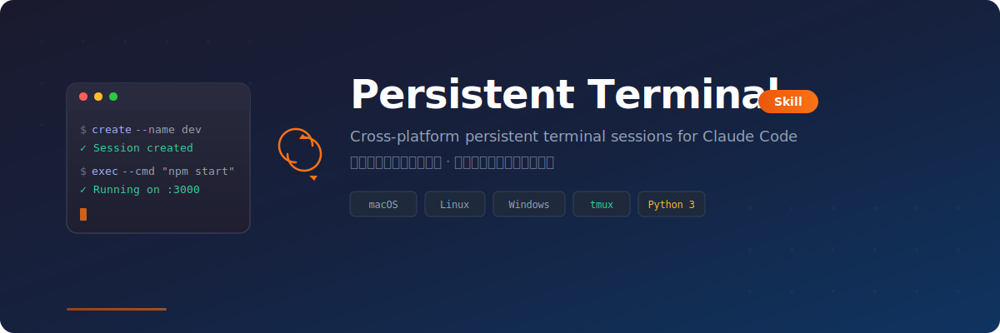

<div align="center">



</div>

# Persistent Terminal Skill

A cross-platform persistent terminal session manager skill for Claude Code. Maintain the same terminal session across multiple conversation turns — run interactive programs, keep environment variables, and preserve process state.

**English** | [中文](README_CN.md) | [Changelog](CHANGELOG.md)

---

## Features

### Core
- **Persistent Sessions** - Terminal sessions survive across multiple Claude Code conversation turns
- **Cross-Platform** - macOS/Linux (tmux) and Windows (subprocess) support
- **Session Management** - Create, attach, execute, read, close sessions with simple commands
- **Foreground & Background** - Choose between visible terminal windows or silent background sessions

### Highlights
- **Interactive Input** - Send raw text for passwords and interactive prompts
- **Special Character Bypass** - Read text from JSON config files to avoid bash escaping issues
- **JSON Output** - All commands return structured JSON for easy parsing
- **Auto Cleanup** - List and close stale sessions

---

## System Requirements

| Platform | Requirement |
|----------|-------------|
| macOS | Python 3, tmux (auto-installed) |
| Linux | Python 3, tmux (auto-installed) |
| Windows | Python 3 |

---

## Installation

### Option 1: Clone the Repository

```bash
git clone https://github.com/Tonyhzk/persistent-terminal-skill.git
```

### Option 2: Install as a Claude Code Skill

Copy the `src/persistent-terminal` directory into your Claude Code Skills directory.

### Shared Configuration (Optional)

If you need to share `.claude` configuration across multiple projects, use the symlink tool:

```bash
python3 setup_claude_dir.py
```

It supports both interactive menu and CLI mode:

```bash
python3 setup_claude_dir.py link      # Create symlink
python3 setup_claude_dir.py unlink    # Remove symlink
python3 setup_claude_dir.py status    # Show current status
```

---

## Usage

Once installed, invoke via `/tool-persistent-terminal` in Claude Code, or mention keywords like "persistent terminal" or "terminal session" to trigger automatically.

### Available Commands

| Command | Description |
|---------|-------------|
| `create` | Create a new terminal session |
| `attach` | Attach to an existing session (live output) |
| `exec` | Execute a command in a session |
| `read` | Read recent output from a session |
| `send` | Send raw text (for passwords, interactive input) |
| `list` | List all active sessions |
| `close` | Close a specific session |
| `close-all` | Close all sessions |

### Parameters

| Parameter | Description |
|-----------|-------------|
| `--name` | Session name identifier |
| `--cmd` | Command to execute |
| `--timeout` | Exec wait timeout in seconds (default: 10) |
| `--lines` | Number of lines to read (default: 30) |
| `--max-chars` | Max characters for read output (default: 2000, 0 for unlimited) |
| `--output` | Write read output to file instead of stdout (saves context) |
| `--shell` | Specify shell (default: bash on macOS/Linux, cmd on Windows) |
| `--background` | Create session without attaching |
| `--text` | Raw text to send |
| `--config` | JSON config file path for send |
| `--key` | JSON key path (dot-separated) |

---

## Use Cases

- Start a dev server and interact with it across conversation turns
- Maintain SSH connections for multiple remote commands
- Run multi-step tasks that require persistent environment variables
- Interactive programs (Python REPL, database clients, etc.)

---

## Project Structure

```
persistent-terminal-skill/
├── src/persistent-terminal/   # Skill source
│   ├── SKILL.md               # Skill definition
│   └── scripts/               # Core scripts
├── 1_Script/                  # Utility scripts
├── setup_claude_dir.py        # Symlink management tool
├── README.md                  # English docs
└── README_CN.md               # Chinese docs
```

---

## License

[Apache License 2.0](LICENSE)

## Author

**Tonyhzk**

- GitHub: [@Tonyhzk](https://github.com/Tonyhzk)
- Project: [persistent-terminal-skill](https://github.com/Tonyhzk/persistent-terminal-skill)